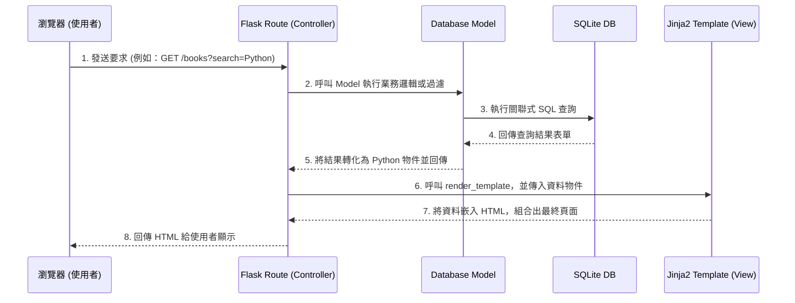

# 系統架構設計：讀書筆記本系統

## 1. 技術架構說明

為了達成 PRD 中規劃的「記錄、心得、評分、搜尋與標籤分類」功能，本專案將採用輕量且成熟的技術棧，配合 MVC（Model-View-Controller）設計模式，確保專案易於開發、維護與擴充。

### 選用技術與原因
- **後端框架：Python + Flask**
  - **原因**：Flask 是高度輕量且靈活的框架，沒有過多的預設限制，非常適合像此專案大小的中小型應用，能快速建立所需路由與業務邏輯。
- **模板引擎：Jinja2**
  - **原因**：Jinja2 是 Flask 預設支援的引擎，它可以讓我們直接在 HTML 中動態插入伺服器端的資料。相較於將系統拆分為前後端兩種架構，使用 Jinja2 算繪頁面能顯著提升早期 MVP 版本的開發效率。
- **資料庫：SQLite（搭配 sqlite3 或 SQLAlchemy）**
  - **原因**：SQLite 是無伺服器的輕量級資料庫系統，所有資料僅存放在一個本地檔案中。它無須繁雜的資料庫安裝與組態設定，效能足以應付個人讀書筆記本的使用場景與搜尋需求。

### Flask MVC 模式說明
我們在 Flask 專案中將透過資料夾切分來實現 MVC 關注點分離的理念：
- **Model（模型層）**：處理與資料庫的直接互動，定義資料表結構並封裝所有新增、讀取、修改、刪除（CRUD）的邏輯。
- **View（視圖層）**：由 Jinja2 模板（`.html` 檔案）負責，接收從控制器傳來的純資料，結合 HTML/CSS 將 UI 輸出並顯示在瀏覽器。
- **Controller（控制層）**：即為 Flask 裡的路由（Routes），是核心的中樞。負責接收用戶端的 HTTP 請求，接著呼叫 Model 層取得或更改資料，最後選擇對應的 View 並將資料傳遞過去進行算繪。

---

## 2. 專案資料夾結構

本專案建議依照下列目錄結構來組織程式碼：

```text
web_app_development/
├── app/                  # 主要應用程式邏輯
│   ├── models/           # 處理資料庫與表單操作 (Model)
│   │   ├── __init__.py
│   │   └── book_model.py # 筆記紀錄與標籤的關聯與操作
│   ├── routes/           # 定義 URL 路由與流程控制 (Controller)
│   │   ├── __init__.py
│   │   └── book_route.py # 負責處理列表、新增、編輯以及搜尋邏輯
│   ├── templates/        # Jinja2 渲染用的 HTML 模板 (View)
│   │   ├── base.html     # 共用版型（全域導覽列、底端資訊等）
│   │   ├── index.html    # 首頁（顯示筆記清單與搜尋列）
│   │   ├── create.html   # 新增筆記頁面（表單）
│   │   ├── edit.html     # 編輯既有筆記的頁面
│   │   └── view.html     # 單獨檢視一本筆記的詳細資訊
│   └── static/           # 靜態資源檔案
│       ├── css/
│       │   └── style.css # 共用的樣式定義檔
│       └── js/
│           └── main.js   # 輔助性的簡單 JavaScript 邏輯
├── instance/             # 環境或機密資料隔離放置區
│   └── database.db       # 實際的 SQLite 資料庫檔案
├── docs/                 # 系統設計文件
│   ├── PRD.md            # 產品需求文件
│   └── ARCHITECTURE.md   # [目前文件] 系統架構說明
├── requirements.txt      # 記錄相依的 Python 套件（如：Flask）
└── app.py                # Flask 程式啟動入口
```

---

## 3. 元件關係圖

以下展示各元件整合後，處理一段 HTTP 請求（例如：查詢並顯示筆記清單）的資料流向關係：



---

## 4. 關鍵設計決策

1. **一體化架構 (Server-Side Rendering)**
   - **決策**：在後端完成所有的 HTML 輸出，不使用 Vue/React。
   - **原因**：筆記系統的首要目標是資料建檔與瀏覽，操作複雜性低。從一體化架構開始，能讓開發團隊專注於功能的交付並有效壓縮開發時程。

2. **採用 RESTful 思維設計路由**
   - **決策**：對功能分類並設計可讀性高的 URL 結構（如 `/books` 表示所有書籍，`/books/create` 處理新增）。
   - **原因**：這種資源導向的設計可以使得程式碼的意圖更為直白，且如果未來準備支援手機 App 等其他客戶端，將更容易平滑重構出獨立的 API 系統。

3. **專注於單一資料庫實例（SQLite）**
   - **決策**：初期無需架設 MySQL 或 PostgreSQL 伺服器，統一採用內建即可運行的 SQLite。
   - **原因**：大幅降低本系統的部屬困難度與基礎建設成本。SQLite 的交易處理完全足以應付學生個人日常的讀書筆記規模與低延遲文字搜尋。
