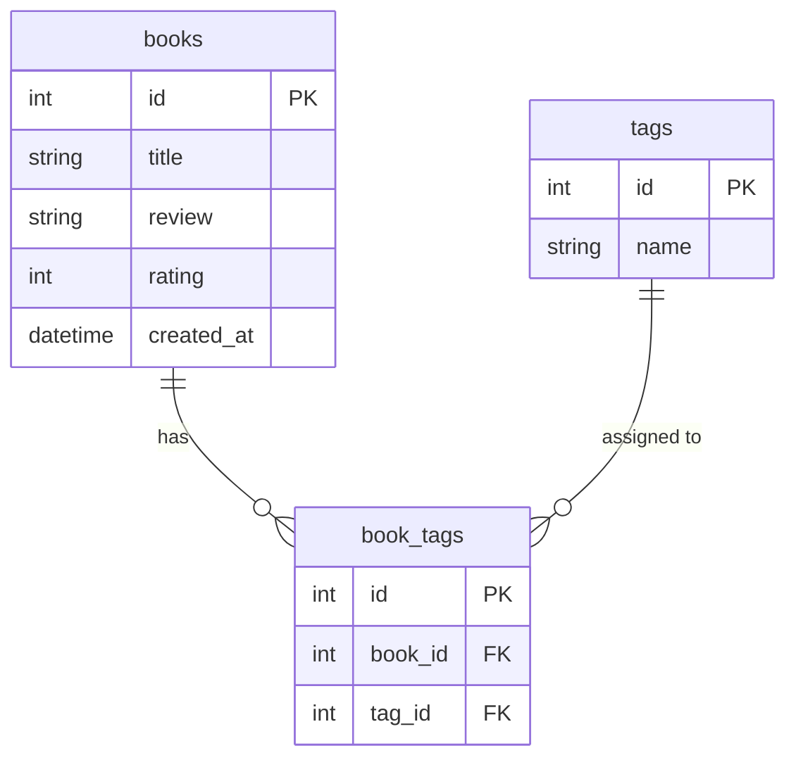

# 資料庫設計文件 (DB Design)

## 1. ER 圖（實體關係圖）

## 2. 資料表詳細說明

### `books` (筆記紀錄)
儲存使用者的讀書筆記主要資訊。

| 欄位名稱 | 型別 | 必填 | 說明 |
| --- | --- | --- | --- |
| `id` | INTEGER | 是 | Primary Key，自動遞增 |
| `title` | TEXT | 是 | 書名 |
| `review` | TEXT | 是 | 閱讀心得與重點筆記 |
| `rating` | INTEGER | 是 | 評分 (1~5 星) |
| `created_at` | DATETIME | 是 | 建立時間，預設為當前時間 |

### `tags` (標籤)
儲存所有可用的分類標籤。

| 欄位名稱 | 型別 | 必填 | 說明 |
| --- | --- | --- | --- |
| `id` | INTEGER | 是 | Primary Key，自動遞增 |
| `name` | TEXT | 是 | 標籤名稱，需唯一 |

### `book_tags` (筆記與標籤的關聯表)
處理 `books` 與 `tags` 的多對多關係。

| 欄位名稱 | 型別 | 必填 | 說明 |
| --- | --- | --- | --- |
| `id` | INTEGER | 是 | Primary Key，自動遞增 |
| `book_id` | INTEGER | 是 | Foreign Key，對應 `books.id` |
| `tag_id` | INTEGER | 是 | Foreign Key，對應 `tags.id` |

---

## 3. SQL 建表語法

請參考 `database/schema.sql` 檔案，該檔案包含了完整的 SQLite 建表語法。
