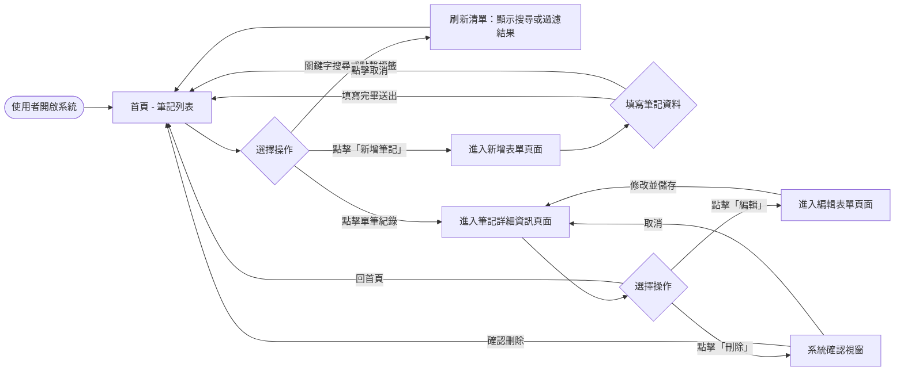
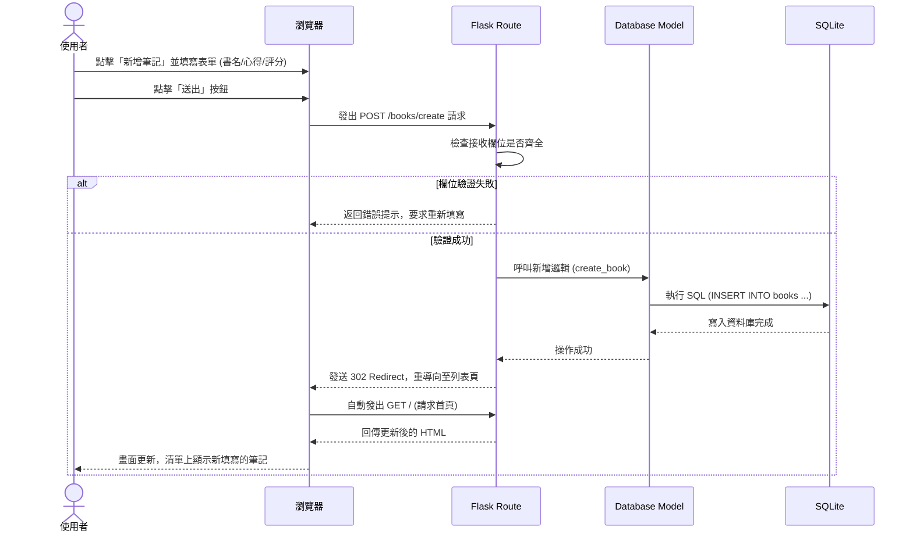

# 流程圖：讀書筆記本系統

本文件涵蓋使用者的操作流程圖（User Flow）與系統處理資料的序列圖（Sequence Diagram），並附帶各功能與路由的清單對照表。

## 1. 使用者流程圖（User Flow）

以下圖表展示使用者進入系統後的各種操作路徑，包含瀏覽列表、搜尋、新增筆記、編輯與刪除等行為。

## 2. 系統序列圖（Sequence Diagram）

以下序列圖描述使用者執行**「新增筆記紀錄」**時，從瀏覽器填寫表單到資料寫入 SQLite，最終重新導向顯示成功畫面的完整技術流程。

## 3. 功能清單對照表

本清單列出了每個操作行為所對應的 URL 路徑與 HTTP Request Method：

| 功能描述 | HTTP 方法 | URL 路徑 | 對應動作與頁面 |
| --- | --- | --- | --- |
| 檢視所有筆記列表 | `GET` | `/` 或 `/books` | 顯示首頁清單 `index.html`（可處理 `?search=` 參數） |
| 最新單筆詳細內容 | `GET` | `/books/<id>` | 取得該筆筆記並渲染至 `view.html` |
| 取得新增紀錄表單 | `GET` | `/books/create` | 顯示填寫用空白表單頁面 `create.html` |
| 提交新增筆記資料 | `POST` | `/books/create` | 接收表單內容、存入資料庫、重導向至清單 |
| 取得編輯紀錄表單 | `GET` | `/books/<id>/edit`| 將現有紀錄帶入編輯表單頁面 `edit.html` |
| 儲存編輯變更資料 | `POST` | `/books/<id>/edit`| 將修改後的值更新至資料庫（純表單通常使用 POST） |
| 刪除指定筆記 | `POST` | `/books/<id>/delete`| 在資料庫移除該筆資料並重導向回清單 |
